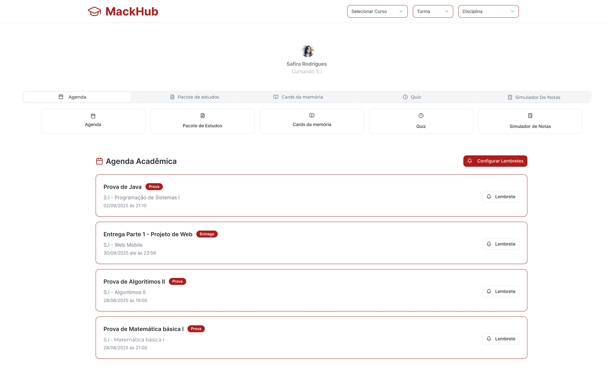
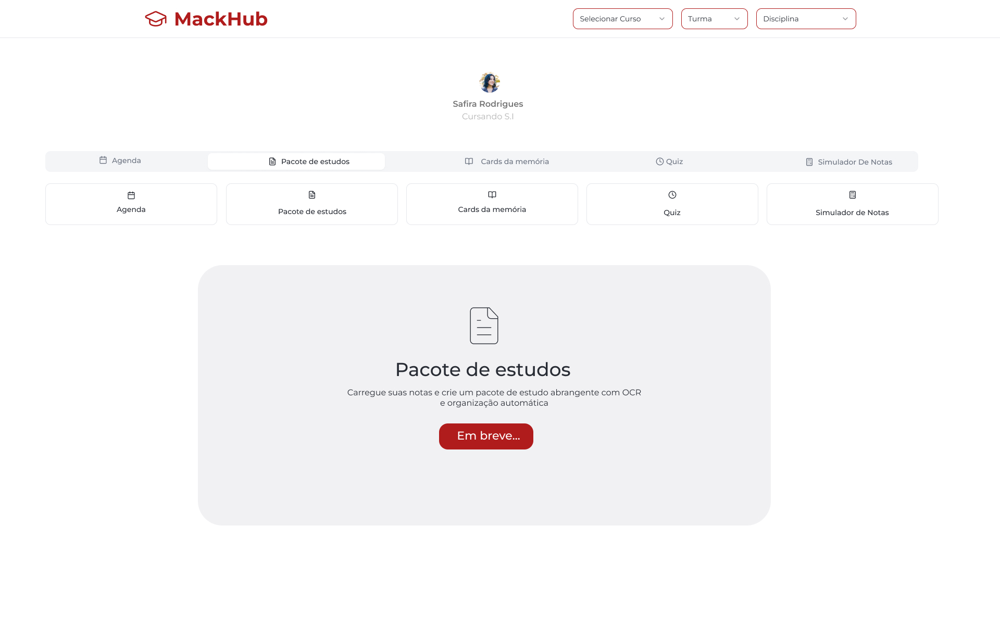
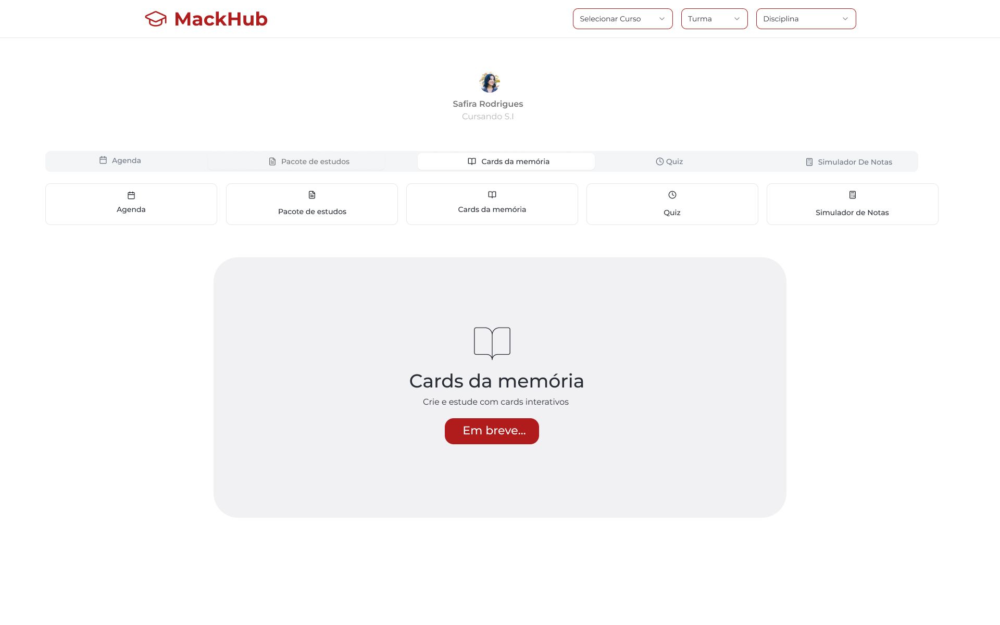
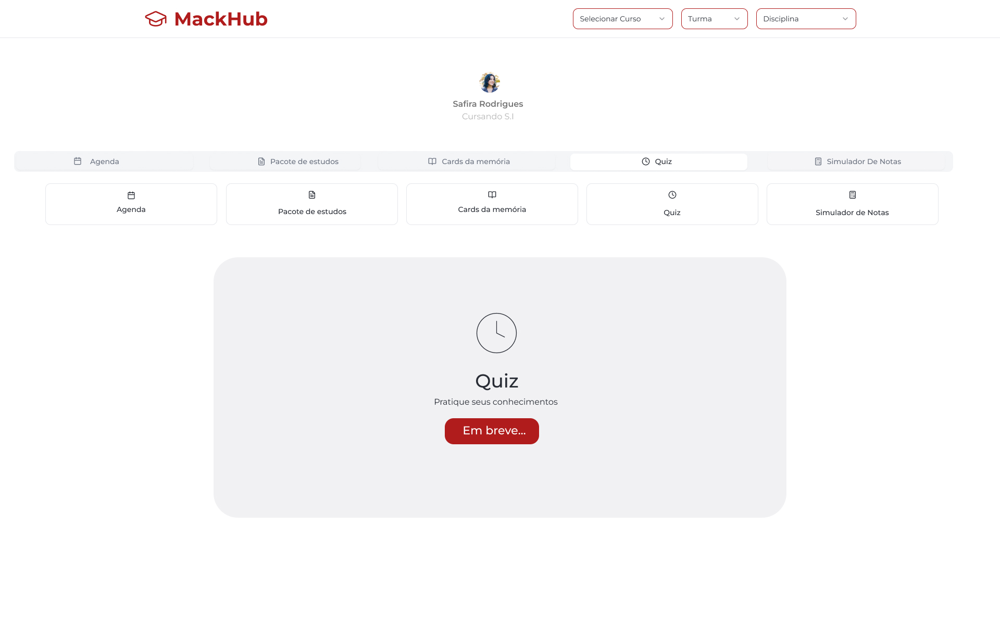
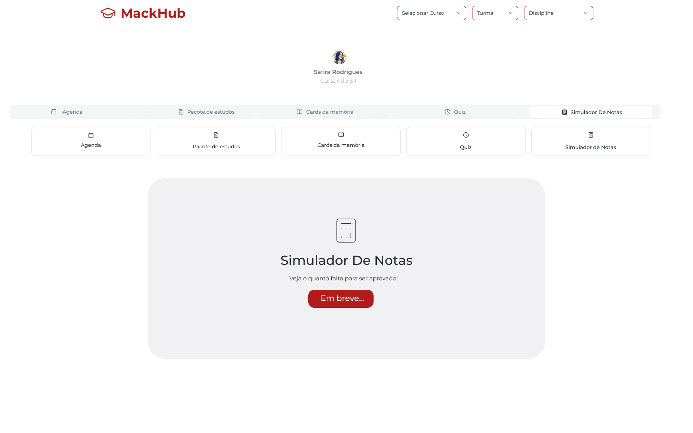

# 🎓 MackHub

MackHub é uma plataforma acadêmica desenvolvida por alunos do **Mackenzie** com o objetivo de centralizar organização, estudo colaborativo e revisão de conteúdos.  
O projeto nasceu como um **MVP** (Minimum Viable Product), mas com potencial para se tornar uma plataforma **open source** e futuramente envolver cursos inteiros, professores e diferentes turmas da universidade.  

---

## 🚀 Objetivo

- Facilitar a **organização acadêmica** (agenda, prazos, provas).  
- Reunir **materiais de estudo** (notas, fotos, resumos, pacotes).  
- Estimular o **aprendizado ativo** (flashcards, quiz).  
- Auxiliar no **planejamento de aprovação** (simulador de notas).  
- Criar uma **rede colaborativa** entre alunos do Mackenzie.  

---

## 🛠️ Tecnologias (MVP)

- **Frontend:** HTML5, Tailwind Css, JavaScript. 
- **Back-end:** Kotlin, Spring Boot, MS SQL SERVER, Redis, Docker.
- **Nuvem:** AWS
  
---

## 📖 Tutorial das Telas

### 1. 🏠 Home + Agenda

- Seleção de **Curso → Turma → Disciplina**.  
- Exibição da **Agenda Acadêmica** com eventos (provas, entregas, aulas).  
- Cada card mostra disciplina, tipo (Prova/Entrega) e data/hora.  
- **Botão de lembrete** para não perder prazos.  

👉 Funciona como **painel central de organização** do aluno.  

---

### 2. 📦 Home + Pacote de Estudos

- Upload de notas (texto, imagem da lousa, PDFs).  
- **OCR** transforma imagens em texto.  
- Geração de **Pacote de Estudo** consolidado:  
  - Capa (curso/turma/disciplina).  
  - Tópicos da prova.  
  - Resumo unificado.  
  - Links para flashcards e quiz.  
- Exportação em **PDF** para revisão offline.  

👉 Centraliza tudo que o aluno precisa estudar antes da prova.  

---

### 3. 🃏 Home + Cards da Memória

- Flashcards interativos para fixação de conteúdo.  
- Baseados em perguntas/respostas ou termo/definição.  
- O aluno marca se sabe ou não a resposta.  
- Repetição maior para cards difíceis.  
- **Status atual:** *Em breve*.  

👉 Reforça aprendizado ativo com revisão rápida.  

---

### 4. 🎮 Home + Quiz

- Questões de múltipla escolha geradas a partir dos resumos/flashcards.  
- **Timer por questão** para simular pressão real.  
- Feedback imediato (correto/incorreto).  
- Tela final com pontuação e análise de desempenho.  
- **Status atual:** *Em breve*.  

👉 Permite **simular provas** e revisar pontos fracos.  

---

### 5. 🧮 Home + Simulador de Notas

- Inserção de notas parciais e pesos das avaliações.  
- Cálculo automático da nota mínima necessária para aprovação.  
- Cores para feedback:  
  - ✅ Verde → situação controlada.  
  - ❌ Vermelho → situação crítica.  
- Sugestão de revisão via Pacote de Estudos e Cards.  
- **Status atual:** *Em breve*.  

👉 Responde à clássica dúvida: *“Quanto preciso tirar para passar?”*  

---

## 🔮 Próximos Passos

- ✅ Melhorar a **Agenda** com calendário moderno (visual mensal/diário).  
- 🔄 Lançar **Flashcards e Quiz** no MVP.  
- 📦 Evoluir o **Pacote de Estudos** com IA para sumarizar e gerar perguntas.  
- 🌐 Expandir para **multi-turma e multi-curso**.  
- 🏫 Adaptação institucional para envolver toda a faculdade.  

---

## ✨ Caráter Extensionista

O MackHub é um projeto **feito por alunos e para alunos**.  
Ele começa ajudando **uma turma**, mas tem potencial para apoiar **toda a comunidade acadêmica Mackenzie**, fortalecendo a colaboração, organização e aprendizado.  

---
